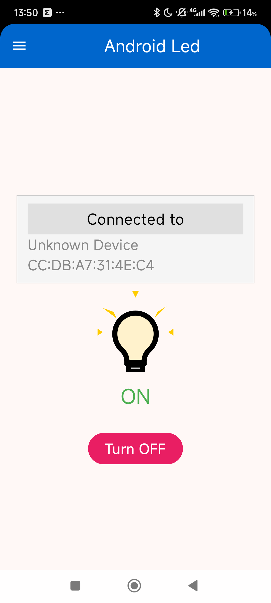
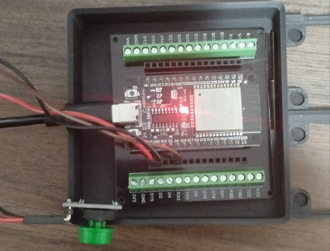
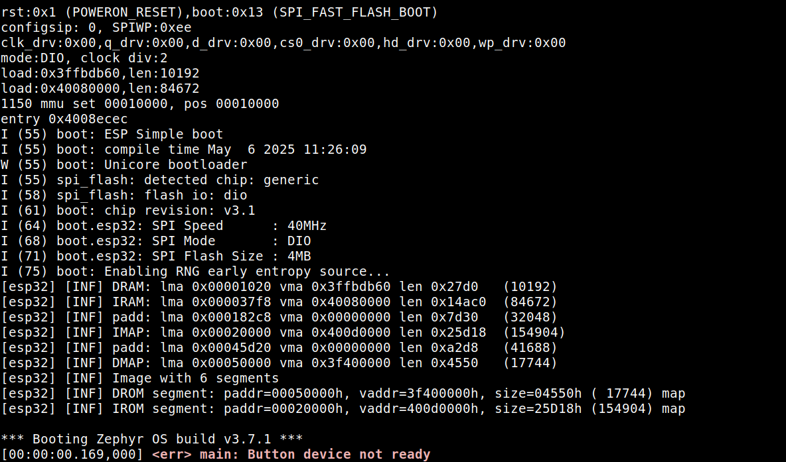
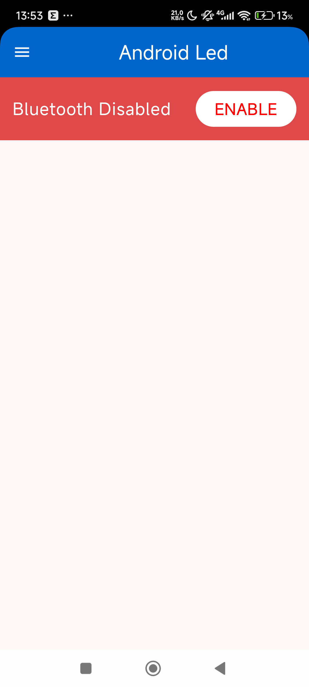
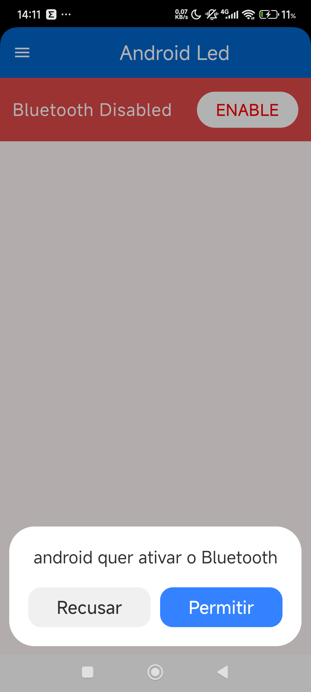
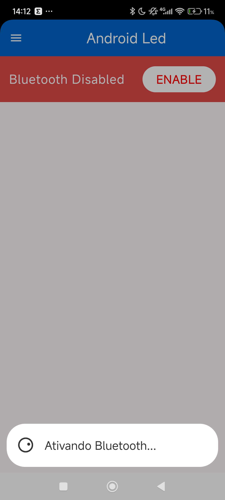
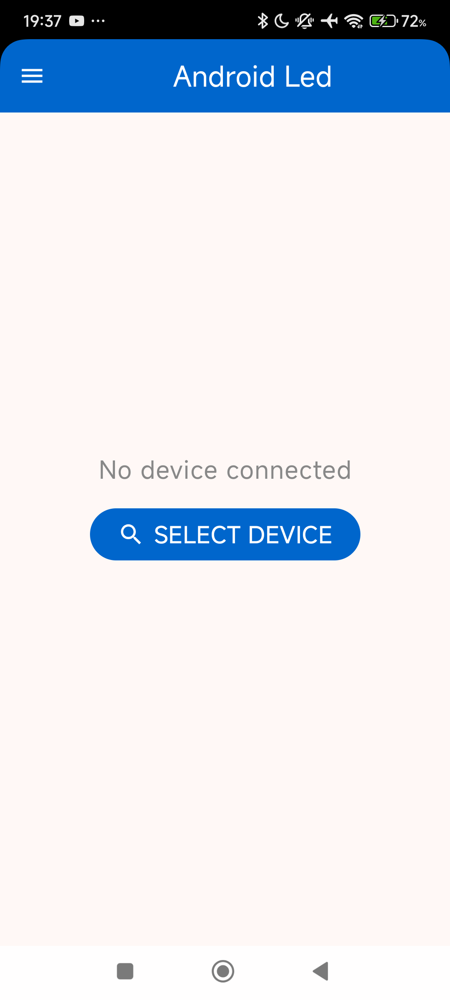
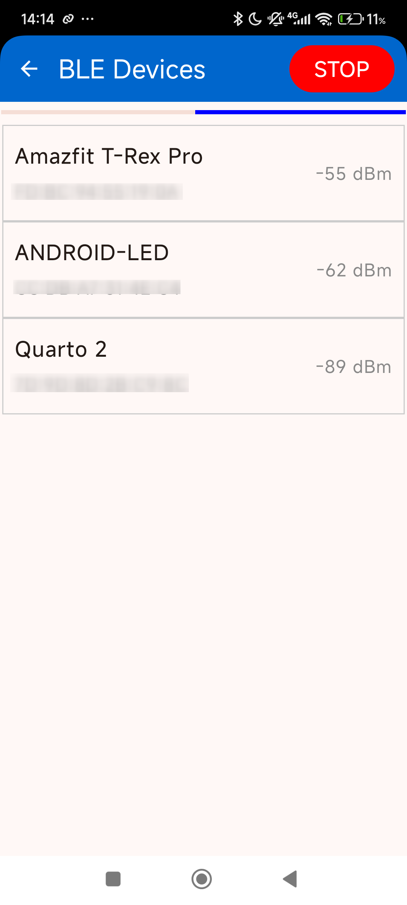
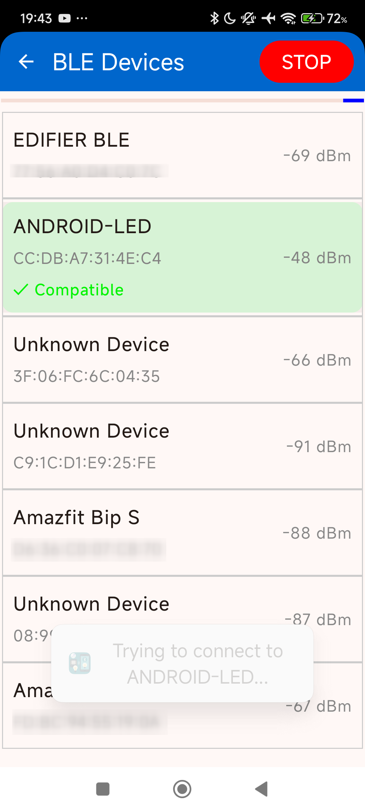
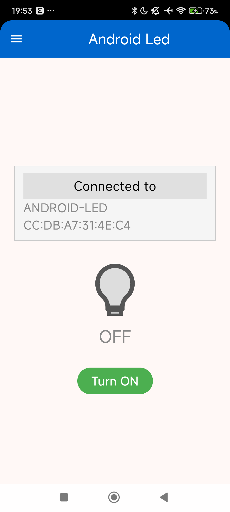

# Experimento 01 - BLE-LED-CONTROL

<div style="display: flex; justify-content: space-around; align-items: center;">
    
    
</div>


## Introdução
Cada vez mais, nós engenheiros de software enfrentamos projetos que tecem um relacionamento estreito com uma infinidade de tecnologias, frameworks, diversidade de linguagens de programação empregadas em um único projeto, ferramentas de desenvolvimento, padrões de design, bibliotecas, APIs, múltiplos sistemas operacionais e em soluções embedded preferencialmente: **compatibilidade e portabilidade para múltiplas plataformas de hardware**. 

Portanto, ao lidar com sistemas de natureza muito complexa, uma abordagem sábia durante a fase de projeto — anterior ao desenvolvimento — é validar se os componentes escolhidos são, de fato, os mais adequados para o problema a ser resolvido.
Acredito que a abordagem mais eficaz consiste em, após a definição inicial das tecnologias que serão/poderão utilizadas no projeto, reservar um tempo para validá-las como protótipos totalmente funcionais.
É algo semelhante ao que ocorre em matemática: é preciso verificar se os axiomas de que dispomos são suficientes para resolver o problema proposto.

Recentemente tive a oportunidade de participar de um projeto interessantíssimo que, assim como descrito acima, envolveu uma infinidade de tecnologias e em se tratando ainda de um POC foi não só necessário validar que o projeto em si seria factível como também determinar que as tecnologias escolhidas seriam as mais adequadas para sua implementação. Assim tive 15 dias não só para modelar a solução macro como também para definir os diversos 'elementos-axiomáticos' que comporiam o projeto. 

Como resultado desta experiência, resolvi compartilhar com vocês alguns dos experimentos que fiz para conhecer melhor as bibliotecas, APIs, ferramentas de desenvolvimento e hardwares. 

Ao longo das próximas semanas, estarei postando artigos semelhantes sobre cada um dos demais experimentos que realizei.

### Experimento 1 - 01-ble-led-control-android-zephyr

O primeiro experimento visava conhecer melhor o necessário para desenvolver a solução mobile o firmware e a comunicação entre ambos.
* **Kotlin**: seria essa a melhor linguagem para desenvolvimento e para o possível enfrentamento da multiplataforma (Android, desktop e possivelmente iOS)? 
* **BLE**: Bluetotth LE é um 'axioma', pois os dispositivos de hardware serão alimentados apenas bateria. Deverão estar a maior parte do tempo em deep sleep e acordar apenas quando necessário.  
* **BLE em Android**: aspectos de implementação e APIs disponíveis. Qual a melhor biblioteca para comunicação BLE?
* **UI**: A interface do usuário no Android deveria ser desenvolvida com Jetpack Compose ou XML? Conhecia quase nada de Jetpack Compose e queria conhecer melhor a biblioteca.
* **Zephyr RTOS**: por conhecer razoavelmente bem Zephyr RTOS, resolvi utilizá-la para o desenvolvimento do firmware do dispositivo, mas ainda havia configurações a serem descobertas e utilização de APIs que também  não conhecia.
* **Dispositivo de hardware**: Deveria ser utilizado um Nordic, ESP32 ou outro? Qual seria o mais adequado para o projeto, considerando as necessidades específicas, e quais subtipos (832, 840, S2, S3, C3) de cada um atenderiam melhor a esses requisitos?


### Organização dos projetos-teste

Assim, para testar todos os elementos acima em um projeto simples e completo, desenvolvi um projeto que consiste em um aplicativo Android que controla um LED em um dispositivo de hardware via Bluetooth Low Energy (BLE). O firmware do dispositivo foi desenvolvido utilizando Zephyr RTOS, e o aplicativo Android foi desenvolvido em Kotlin, utilizando Jetpack Compose para a interface do usuário.

Para este e outros projetos, todo o código-fonte necessário para a execução completa dos testes estará disponível em um único repositório, organizado em diretórios principais que representam o código mobile, o firmware, as anotações e outros escopos relevantes, quando aplicável.

## Android-Led

### Zephyr - Firmware
O firmware foi desenvolvido utilizando o Zephyr RTOS na versão 3.7.1. 

O código está em apenas um arquivo fonte `src/main.c` que implementa um sistema que controla um LED usando Bluetooth Low Energy (BLE) e um botão físico que alterna o estado do LED. Abaixo está uma breve explicação de como ele funciona:
elementos
#### Benefícios do uso de DTS no Zephyr:
- **Abstração de Hardware**: O DTS separa a lógica do software da configuração do hardware, facilitando a portabilidade do código.
- **Manutenção Simplificada**: Alterações no hardware podem ser feitas apenas no arquivo DTS, sem necessidade de modificar o código-fonte.
- **Reutilização de Código**: Permite que o mesmo código seja usado em diferentes dispositivos, reduzindo o esforço de desenvolvimento.
- **Organização**: Centraliza as definições de hardware, tornando o projeto mais organizado e fácil de entender.

 
```dts
/ {
    leds {
        compatible = "gpio-leds";
        led0: led_0 {
            gpios = <&gpio0 13 GPIO_ACTIVE_HIGH>;
            label = "LED 0";
        };
    };

    buttons {
        compatible = "gpio-keys";
        button0: button_0 {
            gpios = <&gpio0 11 GPIO_ACTIVE_LOW>;
            label = "Button 0";
        };
    };
};
```
Por exemplo, no trecho acima, o DTS define os pinos GPIO para o LED e o botão. Caso o hardware seja alterado (como o LED ser conectado a outro pino), basta atualizar o arquivo DTS para refletir essa mudança. Além disso, o uso do DTS facilita a migração entre diferentes plataformas de hardware, como trocar de um ESP32 para um Nordic. Nesse caso, seria necessário apenas ajustar o arquivo DTS para refletir as configurações específicas do novo hardware, enquanto o código-fonte principal permaneceria **inalterado**, garantindo maior portabilidade e eficiência no desenvolvimento.


Comportamento do firmware:

1. **Bluetooth (BLE)**
   - O código em main.c inicializa o Bluetooth e define um **serviço BLE** com uma característica chamada "LED".
   - Essa característica permite:
    - **Leitura**: Um dispositivo BLE pode verificar se o LED está ligado ou desligado.
    - **Escrita**: Um dispositivo BLE pode ligar ou desligar o LED remotamente.
    - **Indicação**: O firmware pode enviar notificações para dispositivos BLE conectados quando o estado do LED muda, no código, ao apertar o botão físico no dispositivo, uma notificação é enviada automaticamente, e o aplicativo Android, por estar inscrito para receber notificações, receberá instantaneamente essa modificação no estado do LED.

2. **Callback de Leitura e Escrita**
   - **Leitura**: Quando um dispositivo BLE lê a característica, ele recebe o estado atual do LED (ligado ou desligado).
   - **Escrita**: Quando um dispositivo BLE escreve na característica, o LED é ligado ou desligado, e o estado é atualizado no firmware.

3. **Indicação BLE**
   - Sempre que o estado do LED muda (seja pelo botão ou pelo BLE), o firmware envia uma **indicação** para os dispositivos BLE conectados, informando o novo estado.

4. **Conexão e Desconexão**
   - O código registra callbacks para monitorar quando um dispositivo BLE se conecta ou desconecta, permitindo gerenciar o ciclo de vida da conexão.

5. **Loop Principal**
   - O programa entra em um loop infinito que:
     - Verifica o estado do botão.
     - Se o botão for pressionado e solto, o LED é alternado (ligado/desligado).
     - O estado atualizado do LED é enviado para os dispositivos BLE conectados.

6. **Advertising**
   - O dispositivo começa a "anunciar" sua presença via BLE, permitindo que outros dispositivos o descubram e se conectem.

### Notes:
Caso haja algum erro o led será usado para indicar o erro, piscando rapidamente.
```c
static void int main(void) {
    // if everthing is ok, the led will never blink
    int ret = init();
    //blink indefinite the led to indicate error
    while (ret != 0) {
        led_state = !led_state;
        gpio_pin_set(led.port, led.pin, led_state);
        k_msleep(200);
    }
return 0;
}
```

Como na imagem abaixo, que apresenta o resultado de uma simulação onde foi gerado um erro de configuração no firmware. O LED pisca rapidamente para indicar o erro.

<div style="text-align: center;">
    
</div>


## Android - App
O aplicativo Android foi desenvolvido utilizando Kotlin e Jetpack Compose. 


Comportamento do aplicativo:
1. **identificação do Bluetooth**
   - O aplicativo verifica se o Bluetooth está ativado e solicita ao usuário que ative-o, caso contrário.
   - O aplicativo também verifica se o dispositivo Android tem permissão para usar o Bluetooth.

<div style="display: flex; justify-content: space-around; align-items: center; gap: 2px;">
    
    
    
    
</div>

2. **Conexão com o Dispositivo BLE**
   - O aplicativo escaneia os dispositivos BLE disponíveis e tenta se conectar ao dispositivo desejado.
   - Após a conexão, o aplicativo se inscreve para receber notificações sobre o estado do LED.
  {width=30%}

1. **Conexão com dispositivo BLE que implementa o serviço LED**
   - Ao ser selecionado um dispositivo BLE, o aplicativo tenta se conectar a ele para verificar se ele implementa o serviço LED. Se este serviço estiver implementado, o aplicativo se inscreve para receber notificações sobre o estado do LED e atualiza a ui para refletir o estado atual do LED.
 - 
<div style="display: flex; justify-content: space-around; align-items: center; gap: 2px;">
    
    
    
</div>

1. **Controle do LED**
   - O aplicativo permite que o usuário ligue ou desligue o LED pressionando um botão na interface do usuário ou pressionando o botão físico no dispositivo.

<div style="text-align: center;">
    
</div>


## Conclusão
- A biblioteca Bluetooth da Nordic é uma excelente opção para o desenvolvimento de firmware BLE, pois oferece uma API robusta e fácil de usar.
- Jetpack Compose transformou o desenvolvimento da interface em uma verdadeira brincadeira. Mostrando-se uma excelente opção, porém ainda é necessário ainda investigar certos overheads de desempenho.
- Zephyr é o máximo! Continuo achando a melhor opção para o desenvolvimento de firmware.
- esp32 se compotou bem neste primeiro experimento.


## Referências
- [Android-BLE-Library](https://github.com/NordicSemiconductor/Android-BLE-Library)
- [Jetpack Compose](https://developer.android.com/jetpack/compose)
- [Zephyr RTOS](https://docs.zephyrproject.org/latest/index.html)
- [Espressif](https://www.espressif.com/en)
- [Bluetooth Low Energy](https://www.bluetooth.com/specifications/gatt/)
- [Kotlin](https://kotlinlang.org/)    


