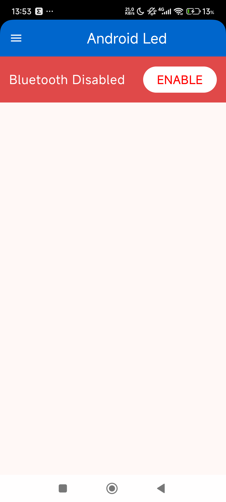
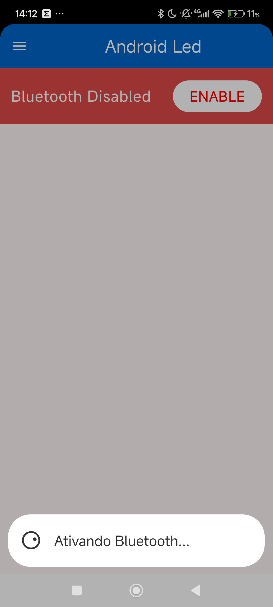

# Experiment 01 - BLE-LED-CONTROL

<div style="display: flex; justify-content: space-around; align-items: center;">
    
    
</div>

## Introduction

More and more we, software engineers, face projects that mix a lot of different technologies, frameworks, many programming languages in a single project, dev tools, design patterns, libraries, APIs, multiple OSs and, specially when talking about embedded solutions: **compatibility and portability across multiple hardware platforms**.

So, when dealing with systems that are very complex, a smart approach during the design phase — before the development itself — is to check if the components chosen are really the best ones to solve the problem.
I believe the most efficient approach is, after picking the main technologies for the project, to save some time to validate them through fully working prototypes.
It’s kinda like what we do in math: we must verify if the axioms we got are enough to solve the problem.

Recently I had a chance to work on a really interesting project that, just like I said before, included a bunch of technologies. And because it was a POC, it was not only needed to check if the project idea was doable, but also to make sure the techs selected would be good for the implementation. So I had 15 days not only to design the whole macro solution but also to define the several “axiomatic elements” that would make up the project.

As a result of this experience, I decided to share some experiments I made to better understand the libraries, APIs, tools and hardware involved.

During the next few weeks, I’ll be posting similar articles about each of the other experiments I did.

### Experiment 1 - 01-ble-led-control-android-zephyr

This first experiment had the goal to get more familiar with what was needed to develop the mobile app, the firmware, and the communication between both.

* **Kotlin**: Is this the best language for the development and maybe for handling multiplatform (Android, desktop and maybe iOS)?
* **BLE**: Bluetooth LE is an 'axiom', because the hardware devices will be battery powered only. They should stay mostly in deep sleep and wake up only when needed.
* **BLE on Android**: checking how it is implemented and what APIs are available. What’s the best BLE library?
* **UI**: Should the user interface in Android be made with Jetpack Compose or XML? I knew very little about Jetpack Compose and wanted to explore it more.
* **Zephyr RTOS**: Since I know Zephyr RTOS reasonably well, I decided to use it to write the firmware. But still there were things I needed to learn about configs and some APIs I never used.
* **Hardware device**: Should it be Nordic, ESP32, or other? Which one is better suited to the project, considering its needs? And which subtype (832, 840, S2, S3, C3) is the best fit?

### Test Projects Organization

So to test all these elements in a single, simple and complete project, I created an Android app that controls an LED in a hardware device through Bluetooth Low Energy (BLE). The firmware was made using Zephyr RTOS, and the Android app was made in Kotlin, with Jetpack Compose for the UI.

For this and other projects, all the source code needed for the tests will be in a single repository, organized in main folders that represent mobile code, firmware, notes and other relevant stuff, when applicable.

## Android-Led

### Zephyr - Firmware

The firmware was developed using Zephyr RTOS, version 3.7.1.

The code is in just one file: `src/main.c`, which implements a system that controls a LED using BLE and a physical button that toggles the LED state. Below is a short explanation of how it works:

#### Benefits of using DTS in Zephyr:

* **Hardware Abstraction**: DTS keeps the software logic separate from hardware config, so it’s easier to move code to different boards.
* **Simpler Maintenance**: Changes to hardware only need updates in DTS file, no need to mess with source code.
* **Code Reuse**: Same code can run on different boards, reducing dev effort.
* **Organization**: Hardware definitions stay in one place, making the project cleaner and easier to understand.

```dts
/ {
    leds {
        compatible = "gpio-leds";
        led0: led_0 {
            gpios = <&gpio0 13 GPIO_ACTIVE_HIGH>;
            label = "LED 0";
        };
    };

    buttons {
        compatible = "gpio-keys";
        button0: button_0 {
            gpios = <&gpio0 11 GPIO_ACTIVE_LOW>;
            label = "Button 0";
        };
    };
};
```

For example, in the code above, the DTS defines the GPIO pins for LED and button. If the hardware changes (like LED connected to other pin), we only need to change the DTS. It also makes it easier to move from one platform (like ESP32) to another (like Nordic). In that case, just update DTS and keep the main code **unchanged**, giving us portability and efficiency.

### Firmware Behavior:

1. **Bluetooth (BLE)**

   * The code in `main.c` starts Bluetooth and defines a **BLE service** with a "LED" characteristic.
   * This characteristic allows:

     * **Read**: a BLE device can check if the LED is on or off.
     * **Write**: a BLE device can turn the LED on or off.
     * **Indication**: the firmware sends a notification when LED state changes, like when pressing the button. If the app is subscribed, it gets notified right away.

2. **Read and Write Callbacks**

   * **Read**: BLE device reads LED current state (on/off).
   * **Write**: BLE device writes new value, LED turns on/off, and firmware updates the state.

3. **BLE Indication**

   * Whenever the LED state changes (by button or BLE), the firmware sends an **indication** to the BLE clients.

4. **Connection and Disconnection**

   * Code tracks when a BLE device connects/disconnects, so we can handle connection lifecycle.

5. **Main Loop**

   * The app runs a forever loop that:

     * Checks button state.
     * If button was pressed/released, toggles LED.
     * Sends new LED state to connected BLE devices.

6. **Advertising**

   * The board starts to “advertise” itself over BLE so other devices can find and connect.

### Notes:

If there is an error, the LED will be used to indicate it by blinking fast.

```c
static void int main(void) {
    // if everthing is ok, the led will never blink
    int ret = init();
    //blink indefinite the led to indicate error
    while (ret != 0) {
        led_state = !led_state;
        gpio_pin_set(led.port, led.pin, led_state);
        k_msleep(200);
    }
return 0;
}
```

Like the picture below, showing a simulation where there was a config error in the firmware. The LED keeps blinking fast to show something’s wrong.

<div style="text-align: center;">
    
</div>

## Android - App

The Android app was made using Kotlin and Jetpack Compose.

App behavior:

1. **Bluetooth Detection**

   * App checks if Bluetooth is on and ask user to enable if not.
   * It also checks if app has permissions to use Bluetooth.

<div style="display: flex; justify-content: space-around; align-items: center; gap: 2px;">
    
    
    
    
</div>

2. **Connecting to BLE Device**

   * The app scans for BLE devices and try to connect to the right one.
   * After connecting, it subscribes to LED state notifications.
  
    <div style="text-align: center;">
        
    </div>    {width=30%}

3. **Connecting to device with LED service**

   * When a device is selected, app tries to connect and check if it has the LED service. If yes, the app subscribes to LED notifications and updates UI accordingly.

<div style="display: flex; justify-content: space-around; align-items: center; gap: 2px;">
    
    
    
</div>

4. **LED Control**

   * User can turn LED on/off by pressing a button on screen or pressing the physical button on board.

<div style="text-align: center;">
    
</div>

## Conclusion

* Nordic’s BLE library is a great choice for BLE firmware dev. It has strong and easy API.
* Jetpack Compose made UI dev really fun. It looks very promising, but I still need to check some performance overheads.
* Zephyr is awesome! I still think it’s the best for firmware development.
* ESP32 worked fine in this first experiment.

## References

* [Android-BLE-Library](https://github.com/NordicSemiconductor/Android-BLE-Library)
* [Jetpack Compose](https://developer.android.com/jetpack/compose)
* [Zephyr RTOS](https://docs.zephyrproject.org/latest/index.html)
* [Espressif](https://www.espressif.com/en)
* [Bluetooth Low Energy](https://www.bluetooth.com/specifications/gatt/)
* [Kotlin](https://kotlinlang.org/)
