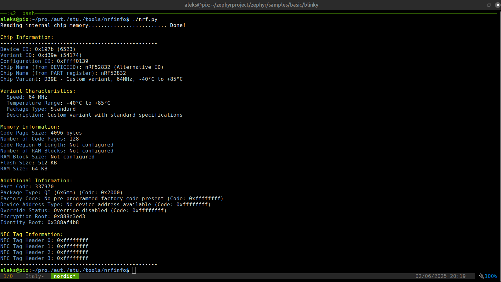
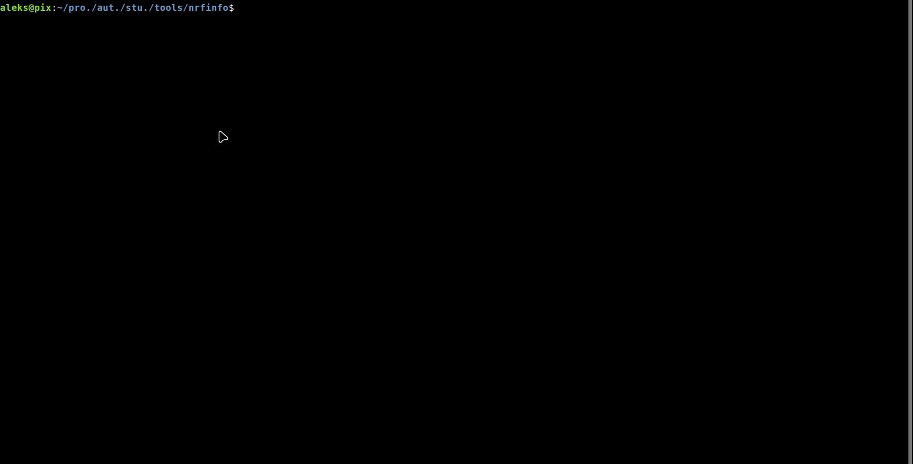

# Nordic Chip Information Reader


Sometimes, when purchasing chips, they come in packages that make it difficult to identify the exact chip model. Additionally, there are cases where the chip sold is not exactly as advertised. This tool helps verify the chip's identity and characteristics directly from its internal registers, ensuring you know precisely what you are working with.


This Python script, `nrf.py`, is a tool for reading detailed information from Nordic Semiconductor chips, such as nRF52832, nRF52840, among others. It uses `pyocd` to connect to the chip and extract register information.

## Features
- Reads internal chip registers.
- Identifies the chip and its variant.
- Displays detailed information about memory, packages, and chip characteristics.
- Supports various Nordic chip variants and packages.

## Requirements
- Python 3.x
- `pyocd` installed and configured.

## Usage
Run the script with the debug option if needed:
```bash
python3 nrf.py -d
```






## References
- [nRF52832 FICR](https://docs.nordicsemi.com/bundle/ps_nrf52832/page/ficr.html)
- [nRF52840 FICR](https://docs.nordicsemi.com/bundle/ps_nrf52840/page/ficr.html)
- [nRF52833 FICR](https://docs.nordicsemi.com/bundle/ps_nrf52833/page/ficr.html)
- [nRF52811 FICR](https://docs.nordicsemi.com/bundle/ps_nrf52811/page/ficr.html)
- [nRF52820 FICR](https://docs.nordicsemi.com/bundle/ps_nrf52820/page/ficr.html)
- [nRF5340 FICR](https://docs.nordicsemi.com/bundle/ps_nrf5340/page/ficr.html)
- [nRF9160 FICR](https://docs.nordicsemi.com/bundle/ps_nrf9160/page/ficr.html)
- [nRF9161 FICR](https://docs.nordicsemi.com/bundle/ps_nrf9161/page/ficr.html)


